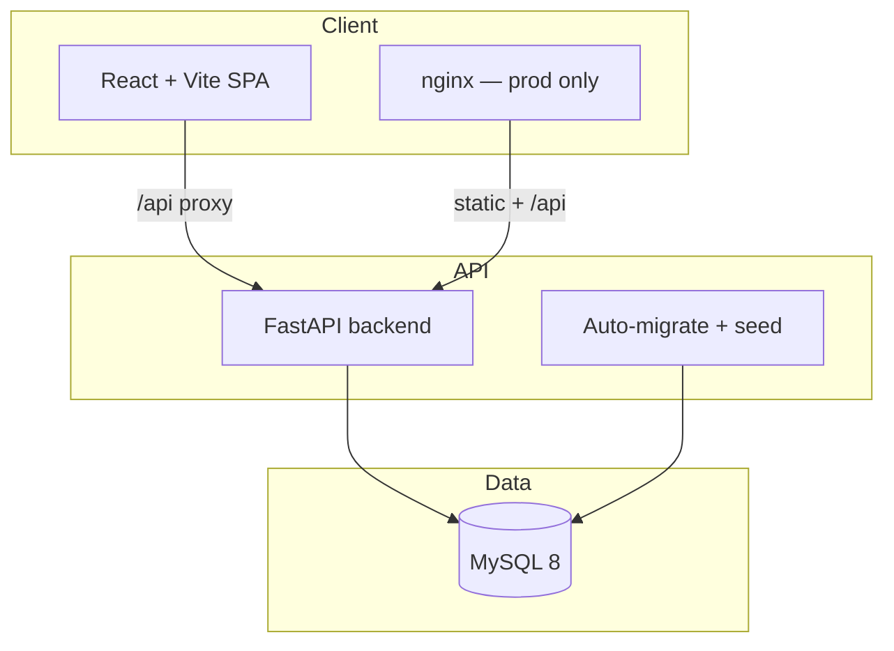

<div align="center">

<h1>
  <span style="color:#edf3ff;font-weight:600;letter-spacing:-1px;">Lugha</span><span style="color:#5DCAA5;">.</span>
</h1>

<p style="font-size:18px;color:#9db0cd;max-width:720px;margin:0 auto;line-height:1.7;">
  <strong style="color:#edf3ff;">African linguistic intelligence infrastructure</strong> — community-verified knowledge graph,
  cultural playground, and API-first design for preserving <strong style="color:#5DCAA5;">2K+ living languages</strong>
  across <strong style="color:#5DCAA5;">54 nations</strong>.
</p>

<br/>


<br/><br/>

<a href="https://github.com/perfectperrito5-art/LUGHA">
  
</a>

</div>

<br/>

<table width="100%" cellpadding="0" cellspacing="0">
<tr>
<td style="background:linear-gradient(135deg,#0a1628 0%,#0F6E56 100%);border-radius:16px;padding:28px 32px;border:1px solid rgba(93,202,165,0.25);">

<p style="margin:0;color:#5DCAA5;font-size:13px;letter-spacing:0.08em;text-transform:uppercase;font-weight:600;">
  Heritage · passed from generation to generation
</p>

<p style="margin:12px 0 0;color:#edf3ff;font-size:22px;line-height:1.4;font-weight:500;">
  “What your grandmother whispered — your children can still hear.”
</p>

<p style="margin:14px 0 0;color:rgba(255,255,255,0.65);font-size:15px;line-height:1.7;max-width:820px;">
  Africa carries proverbs, songs, names, and worlds that most AI has never learned.
  <strong style="color:#edf3ff;">Lugha</strong> is where speakers become <em>guardians</em>: teaching machines your mother tongue,
  archiving oral culture, and carrying our linguistic future forward.
</p>

</td>
</tr>
</table>

<br/>

---

## ✦ At a glance

<table>
<tr>
<td width="25%" align="center" style="padding:16px;">
  <p style="font-size:28px;font-weight:600;color:#1D9E75;margin:0;">2K+</p>
  <p style="font-size:12px;color:#9db0cd;margin:6px 0 0;">African languages</p>
</td>
<td width="25%" align="center" style="padding:16px;">
  <p style="font-size:28px;font-weight:600;color:#1D9E75;margin:0;">54</p>
  <p style="font-size:12px;color:#9db0cd;margin:6px 0 0;">Countries in seed data</p>
</td>
<td width="25%" align="center" style="padding:16px;">
  <p style="font-size:28px;font-weight:600;color:#1D9E75;margin:0;">API</p>
  <p style="font-size:12px;color:#9db0cd;margin:6px 0 0;">First infrastructure</p>
</td>
<td width="25%" align="center" style="padding:16px;">
  <p style="font-size:28px;font-weight:600;color:#1D9E75;margin:0;">∞</p>
  <p style="font-size:12px;color:#9db0cd;margin:6px 0 0;">Community verifications</p>
</td>
</tr>
</table>

---

## ✦ What Lugha does

<table width="100%">
<tr>
<td width="50%" valign="top" style="padding:8px;">

<table width="100%" style="background:#111c31;border:1px solid rgba(173,196,232,0.12);border-radius:14px;">
<tr><td style="padding:20px;">

<p style="margin:0;font-size:20px;">🌿</p>
<h3 style="margin:8px 0 6px;color:#edf3ff;">Teach &amp; Contribute</h3>
<p style="margin:0;color:#9db0cd;font-size:14px;line-height:1.6;">
  Speakers submit words, proverbs, heritage stories, and pronunciation audio.
  Every contribution feeds the knowledge graph with traceable provenance.
</p>

</td></tr>
</table>

</td>
<td width="50%" valign="top" style="padding:8px;">

<table width="100%" style="background:#111c31;border:1px solid rgba(173,196,232,0.12);border-radius:14px;">
<tr><td style="padding:20px;">

<p style="margin:0;font-size:20px;">🔗</p>
<h3 style="margin:8px 0 6px;color:#edf3ff;">Knowledge Graph</h3>
<p style="margin:0;color:#9db0cd;font-size:14px;line-height:1.6;">
  Linguistic assets carry <strong style="color:#5DCAA5;">confidence scores</strong> built from community votes,
  contributor reputation, and verification history — not black-box AI guesses.
</p>

</td></tr>
</table>

</td>
</tr>
<tr>
<td width="50%" valign="top" style="padding:8px;">

<table width="100%" style="background:#111c31;border:1px solid rgba(173,196,232,0.12);border-radius:14px;">
<tr><td style="padding:20px;">

<p style="margin:0;font-size:20px;">🎮</p>
<h3 style="margin:8px 0 6px;color:#edf3ff;">Cultural Playground</h3>
<p style="margin:0;color:#9db0cd;font-size:14px;line-height:1.6;">
  <em>Word Roots</em>, <em>Proverb Circle</em>, and <em>Guardian's Ear</em> turn preservation into play —
  learning through games that reward cultural fluency.
</p>

</td></tr>
</table>

</td>
<td width="50%" valign="top" style="padding:8px;">

<table width="100%" style="background:#111c31;border:1px solid rgba(173,196,232,0.12);border-radius:14px;">
<tr><td style="padding:20px;">

<p style="margin:0;font-size:20px;">🗺️</p>
<h3 style="margin:8px 0 6px;color:#edf3ff;">Heat Map &amp; Live Feed</h3>
<p style="margin:0;color:#9db0cd;font-size:14px;line-height:1.6;">
  Watch contributions light up across the continent. Real-time SSE stream surfaces
  what guardians are teaching right now.
</p>

</td></tr>
</table>

</td>
</tr>
<tr>
<td width="50%" valign="top" style="padding:8px;">

<table width="100%" style="background:#111c31;border:1px solid rgba(173,196,232,0.12);border-radius:14px;">
<tr><td style="padding:20px;">

<p style="margin:0;font-size:20px;">🤖</p>
<h3 style="margin:8px 0 6px;color:#edf3ff;">AI Translator</h3>
<p style="margin:0;color:#9db0cd;font-size:14px;line-height:1.6;">
  Context-aware translation powered by contributed knowledge — with mock, OpenAI, or Gemini providers
  configurable via environment.
</p>

</td></tr>
</table>

</td>
<td width="50%" valign="top" style="padding:8px;">

<table width="100%" style="background:#111c31;border:1px solid rgba(173,196,232,0.12);border-radius:14px;">
<tr><td style="padding:20px;">

<p style="margin:0;font-size:20px;">⚡</p>
<h3 style="margin:8px 0 6px;color:#edf3ff;">Developers API</h3>
<p style="margin:0;color:#9db0cd;font-size:14px;line-height:1.6;">
  Discoverable manifest at <code>GET /api</code>, OpenAPI docs, and versioned v1 routes
  for building the next generation of African-language applications.
</p>

</td></tr>
</table>

</td>
</tr>
</table>

---

## ✦ Design language

Lugha's visual identity draws from the **deep-night continent** palette — midnight blues, aurora greens, and glass surfaces that echo oral tradition meeting modern infrastructure.

<table width="100%">
<tr>
<td style="padding:10px;" width="20%">

<div style="background:#0a1324;border-radius:10px;height:56px;border:1px solid rgba(173,196,232,0.15);"></div>
<p style="margin:8px 0 0;font-size:12px;color:#9db0cd;"><code>#0a1324</code><br/>Deep night</p>

</td>
<td style="padding:10px;" width="20%">

<div style="background:#111c31;border-radius:10px;height:56px;border:1px solid rgba(173,196,232,0.15);"></div>
<p style="margin:8px 0 0;font-size:12px;color:#9db0cd;"><code>#111c31</code><br/>Surface</p>

</td>
<td style="padding:10px;" width="20%">

<div style="background:#1D9E75;border-radius:10px;height:56px;"></div>
<p style="margin:8px 0 0;font-size:12px;color:#9db0cd;"><code>#1D9E75</code><br/>Accent</p>

</td>
<td style="padding:10px;" width="20%">

<div style="background:#5DCAA5;border-radius:10px;height:56px;"></div>
<p style="margin:8px 0 0;font-size:12px;color:#9db0cd;"><code>#5DCAA5</code><br/>Highlight</p>

</td>
<td style="padding:10px;" width="20%">

<div style="background:#edf3ff;border-radius:10px;height:56px;"></div>
<p style="margin:8px 0 0;font-size:12px;color:#9db0cd;"><code>#edf3ff</code><br/>Text</p>

</td>
</tr>
</table>

<p style="color:#9db0cd;font-size:14px;line-height:1.7;">
  <strong style="color:#edf3ff;">UI motifs:</strong> glass registration cards · Africa silhouette hero · language tapestry ·
  kente-inspired accents · confidence badges · mobile-first navigation · radial gradients from <code>#132544</code> to <code>#060d1a</code>.
  The standalone design prototype lives at <code>linguaverse_africa_prototype.html</code> in this repository.
</p>

---

## ✦ Architecture



<table width="100%" style="font-size:14px;">
<tr style="background:#111c31;">
  <th align="left" style="padding:12px;color:#5DCAA5;">Layer</th>
  <th align="left" style="padding:12px;color:#5DCAA5;">Technology</th>
  <th align="left" style="padding:12px;color:#5DCAA5;">Role</th>
</tr>
<tr>
  <td style="padding:12px;color:#edf3ff;">Frontend</td>
  <td style="padding:12px;color:#9db0cd;">React 18 · Vite · Framer Motion · React Router</td>
  <td style="padding:12px;color:#9db0cd;">Landing, dashboard, teach, play, map, developers portal</td>
</tr>
<tr>
  <td style="padding:12px;color:#edf3ff;">Backend</td>
  <td style="padding:12px;color:#9db0cd;">FastAPI · SQLAlchemy · PyJWT · Uvicorn</td>
  <td style="padding:12px;color:#9db0cd;">REST + SSE, auth, confidence engine, games engine</td>
</tr>
<tr>
  <td style="padding:12px;color:#edf3ff;">Database</td>
  <td style="padding:12px;color:#9db0cd;">MySQL 8</td>
  <td style="padding:12px;color:#9db0cd;">Users, contributions, knowledge entries, game rounds</td>
</tr>
<tr>
  <td style="padding:12px;color:#edf3ff;">Containers</td>
  <td style="padding:12px;color:#9db0cd;">Docker Compose</td>
  <td style="padding:12px;color:#9db0cd;">One-command dev or production-style nginx stack</td>
</tr>
</table>

---

## ✦ Quick start — Docker <span style="color:#5DCAA5;">(recommended)</span>

No local Python, Node, or MySQL required — only [Docker](https://docs.docker.com/get-docker/) and [Docker Compose](https://docs.docker.com/compose/).

```bash
git clone https://github.com/perfectperrito5-art/LUGHA.git
cd LUGHA

cp .env.example .env
# optional: edit DB_PASSWORD, JWT_SECRET, ports

docker compose up -d --build
```

<table width="100%">
<tr>
<td style="background:#E1F5EE;border:1px solid #1D9E75;border-radius:12px;padding:16px 20px;">

<p style="margin:0;color:#0F6E56;font-size:14px;">
  <strong>Demo login</strong> — <code>demo@lugha.africa</code> / <code>demo1234</code>
</p>

</td>
</tr>
</table>

<br/>

| Service | URL |
|---------|-----|
| **App** | http://localhost:5173 |
| **API** | http://localhost:8000 |
| **OpenAPI** | http://localhost:8000/docs |
| **API manifest** | http://localhost:8000/api |

### Helper commands

```bash
make up          # docker compose up -d --build
make down        # stop containers
make restart     # down + up (fixes network glitches)
make logs        # follow all logs
make seed        # re-run database seed
make ps          # container status
```

Or use the shell script:

```bash
chmod +x scripts/docker-up.sh
./scripts/docker-up.sh
```

### Production-style stack

Serves a **built** frontend through **nginx** on port 80 (closer to real deployment):

```bash
docker compose down                              # stop dev stack first
docker compose -f docker-compose.prod.yml up -d --build
# open http://localhost  (or FRONTEND_PORT from .env)
```

| Mode | Command | Frontend | Hot reload |
|------|---------|----------|------------|
| **Development** | `docker compose up -d --build` | Vite on `:5173` | ✅ Yes |
| **Production-style** | `docker compose -f docker-compose.prod.yml up -d --build` | nginx on `:80` | ❌ Rebuild required |

> **Tip:** Both stacks share the same MySQL volume (`lugha_mysql_data`), so your data persists when switching modes. Always run `docker compose down` before switching compose files — they use the same container names.

### Troubleshooting Docker

| Symptom | Fix |
|---------|-----|
| `lugha-backend is unhealthy` | `docker compose down && docker compose up -d --build` |
| Port already in use | Change `MYSQL_PORT`, `BACKEND_PORT`, or `FRONTEND_PORT` in `.env` |
| Stale containers | `make clean` — removes volumes (fresh database) |

---

## ✦ App routes

| Path | Page | Description |
|------|------|-------------|
| `/` | Landing | Hero, live stats, join CTA |
| `/register` | Register | Guardian onboarding — languages, country, interests |
| `/login` | Sign in | JWT authentication |
| `/app` | Dashboard | Progress, streaks, quick actions |
| `/teach` | Teach AI | Words, audio, heritage submissions |
| `/translate` | Translator | AI-assisted translation |
| `/heritage` | Heritage | Oral culture archive |
| `/map` | Heat Map | Contribution density across Africa |
| `/play` | Playground | Word Roots · Proverb Circle · Guardian's Ear |
| `/leaderboard` | Leaderboard | Rankings & badges |
| `/live` | Live Feed | Real-time community activity |
| `/developers` | Developers | API manifest & integration guide |

---

## ✦ API surface

Full interactive docs: **http://localhost:8000/docs**

<details>
<summary><strong>Knowledge Graph (v1)</strong> — <code>/api/v1/knowledge</code></summary>

| Method | Route | Description |
|--------|-------|-------------|
| `GET` | `/entries` | Search linguistic assets with confidence scores |
| `GET` | `/entries/{id}` | Single knowledge node |
| `POST` | `/entries/{id}/verify` | Community verification (auth) |

</details>

<details>
<summary><strong>Contributions</strong> — <code>/api/contributions</code></summary>

| Method | Route | Description |
|--------|-------|-------------|
| `POST` | `/` | Submit words & heritage (auth) |
| `GET` | `/` | List with filters |
| `GET` | `/heatmap` | Geographic contribution points |
| `GET` | `/stats` | Global totals |
| `GET` | `/me/stats` | Your guardian stats (auth) |

</details>

<details>
<summary><strong>Cultural Playground</strong> — <code>/api/v1/games</code></summary>

| Method | Route | Description |
|--------|-------|-------------|
| `GET` | `/session` | Today's play stats (auth) |
| `GET` | `/word-roots/round` | Vocabulary game round |
| `GET` | `/proverb-circle/round` | Proverb game round |
| `GET` | `/guardian-ear/round` | Verification game round |
| `POST` | `/answer` | Submit round answer |

</details>

<details>
<summary><strong>Languages · Auth · Live · More</strong></summary>

| Group | Base | Highlights |
|-------|------|------------|
| Languages | `/api/languages` | List, search, 54 countries |
| Auth | `/api/auth` | Register, login, `/me` |
| Translate | `/api/translate` | AI translation |
| Leaderboard | `/api/leaderboard` | Rankings, badges |
| Live Feed | `/api/live-feed` | Recent activity + SSE stream |
| Partners | `/api/partners` | Partner organisations |
| Manifest | `/api` | Discoverable API index |

</details>

---

## ✦ Project layout

```
LUGHA/
├── docker-compose.yml              # Dev: MySQL + API + Vite (hot reload)
├── docker-compose.prod.yml         # Prod-style: MySQL + API + nginx
├── .env.example                    # Copy to .env at repo root
├── Makefile                        # up · down · prod · seed · clean
├── scripts/docker-up.sh
├── linguaverse_africa_prototype.html   # Original HTML design reference
└── lugha_mvp/
    ├── backend/
    │   ├── app/
    │   │   ├── main.py             # FastAPI app + CORS + routers
    │   │   ├── migrations.py       # Auto schema upgrades
    │   │   ├── seed.py             # Demo data + 54 countries
    │   │   ├── routers/            # knowledge, games, auth, …
    │   │   └── services/           # confidence, knowledge logic
    │   ├── Dockerfile
    │   └── docker-entrypoint.sh    # Wait MySQL → seed → uvicorn
    ├── frontend/
    │   ├── src/
    │   │   ├── pages/              # Landing, Teach, Playground, …
    │   │   ├── components/         # Africa map, confidence badges, …
    │   │   └── styles.css          # Lugha design tokens
    │   ├── Dockerfile              # Dev Vite server
    │   ├── Dockerfile.prod         # nginx production build
    │   └── nginx.conf
    └── database/
        └── schema.sql              # Initial MySQL schema
```

---

## ✦ Manual setup (without Docker)

For contributors who prefer native tooling on Ubuntu:

```bash
# MySQL — create database from lugha_mvp/database/schema.sql

cd lugha_mvp/backend
python -m venv venv && source venv/bin/activate
pip install -r requirements.txt
cp .env.example .env   # set DB_HOST=127.0.0.1, credentials
python -m app.seed
uvicorn app.main:app --reload --port 8000

# separate terminal
cd lugha_mvp/frontend
npm ci
npm run dev
```

---

## ✦ Environment variables

Copy `.env.example` → `.env` at the **repository root** (used by Docker Compose).

| Variable | Default | Notes |
|----------|---------|-------|
| `DB_PASSWORD` | *(required)* | MySQL root password |
| `DB_NAME` | `lugha_db` | Database name |
| `DB_HOST` | `mysql` | `127.0.0.1` for manual setup |
| `MYSQL_PORT` | `3307` | Host port (avoids local MySQL conflict) |
| `BACKEND_PORT` | `8000` | API on host (dev compose) |
| `FRONTEND_PORT` | `5173` | App on host (dev) / mapped nginx (prod) |
| `JWT_SECRET` | change me | **Use a long random string in production** |
| `JWT_EXPIRE_MINUTES` | `10080` | Token lifetime (7 days) |
| `AI_PROVIDER` | `mock` | `openai` or `gemini` + `AI_API_KEY` |
| `CORS_ORIGINS` | *(compose sets)* | Comma-separated allowed origins |

---

## ✦ Vision

Lugha is built on a simple conviction: **every language is infrastructure**.

Not a side project for niche apps — but the substrate future African AI must stand on. Speakers verify. Communities govern confidence. Developers build on open APIs. Games keep culture alive between generations.

<table width="100%">
<tr>
<td style="background:linear-gradient(145deg,#111c31,#17253d);border:1px solid rgba(173,196,232,0.12);border-radius:14px;padding:24px 28px;">

<p style="margin:0;color:#edf3ff;font-size:16px;line-height:1.7;font-style:italic;">
  “A language dies every two weeks. But a word saved in Lugha lives forever —
  searchable, verifiable, and ready for the models our children will build.”
</p>

<p style="margin:16px 0 0;color:#5DCAA5;font-size:13px;">
  — The Lugha mission
</p>

</td>
</tr>
</table>

---

## ✦ Contributing

Pull requests welcome.

1. Fork [perfectperrito5-art/LUGHA](https://github.com/perfectperrito5-art/LUGHA)
2. Create a feature branch
3. Make changes under `lugha_mvp/`
4. Run with `docker compose up -d --build` or manual setup
5. Open a PR with a clear description

Areas we'd love help: more language seed data · mobile PWA polish · offline contribution queues · expanded game modes · partner integrations.

---

## ✦ License

Built for preserving Africa's linguistic heritage. See repository license file for terms.

<br/>

<div align="center">

<p style="color:#9db0cd;font-size:14px;">
  <strong style="color:#5DCAA5;">Lugha.</strong> Every language is a living inheritance.
</p>

<p style="color:#9db0cd;font-size:12px;margin-top:8px;">
  Made with care for the continent · 2K+ languages · 54 nations · one graph
</p>

</div>
